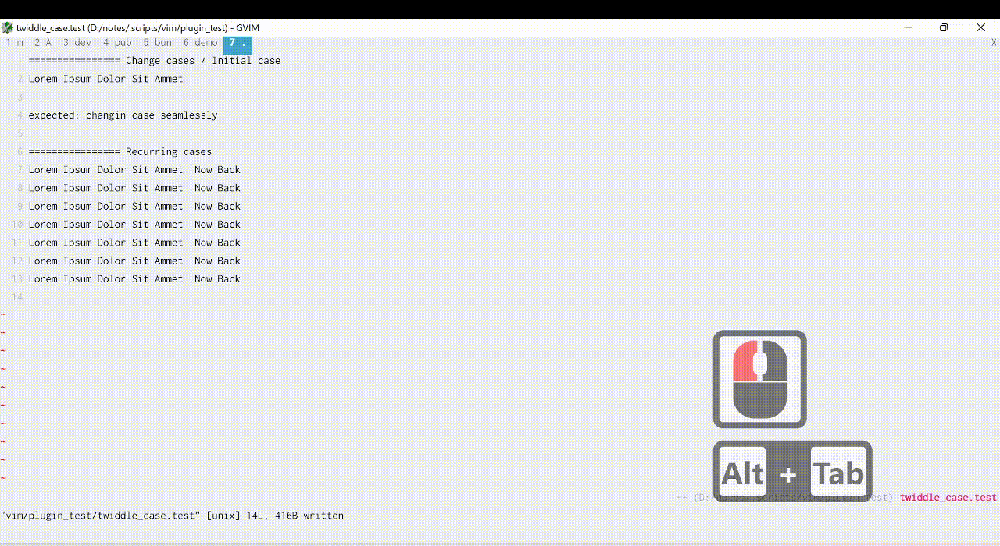

# Feature
This vim plugin allow you to switch case of visually-selected text

#### Demo

# Installation
## Pathogen

Clone this repo to your plugin folder (usually in $HOME/.vim/bundle/)

## Usage : 
1. Select your text
2. press `<alt+i>` once
3. then press `<alt+i>` / `<alt+s+i>` to cycle between case

Available case : 
1. Reset Case
2. camelCase
3. snake_case
4. hyphen-case
5. Title Case
6. lower case
7. UPPER CASE

Note : this plugin extend http://vim.wikia.com/wiki/Switching_case_of_characters 
